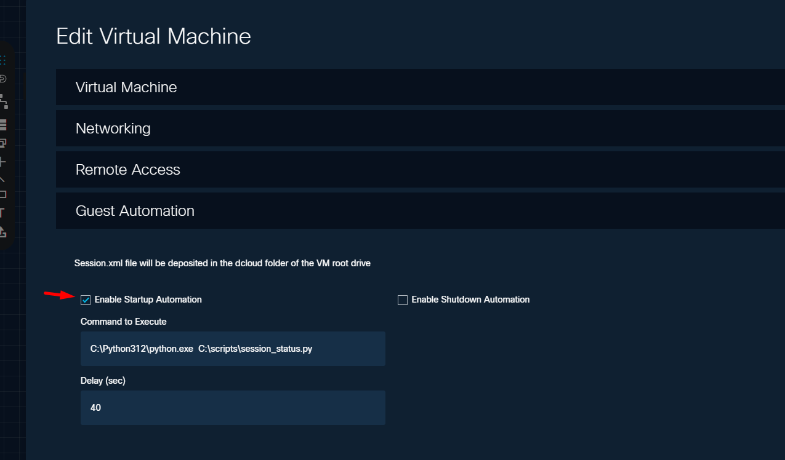
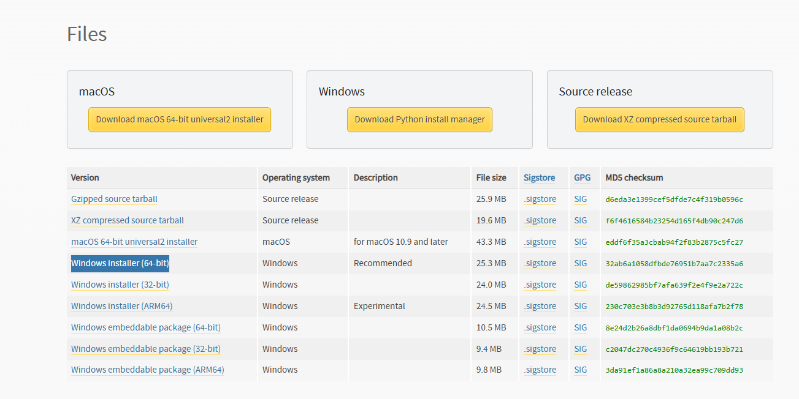
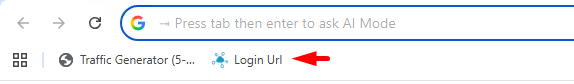
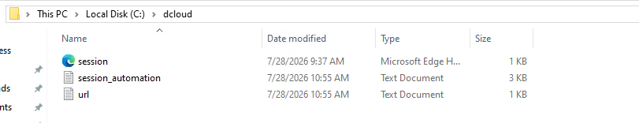
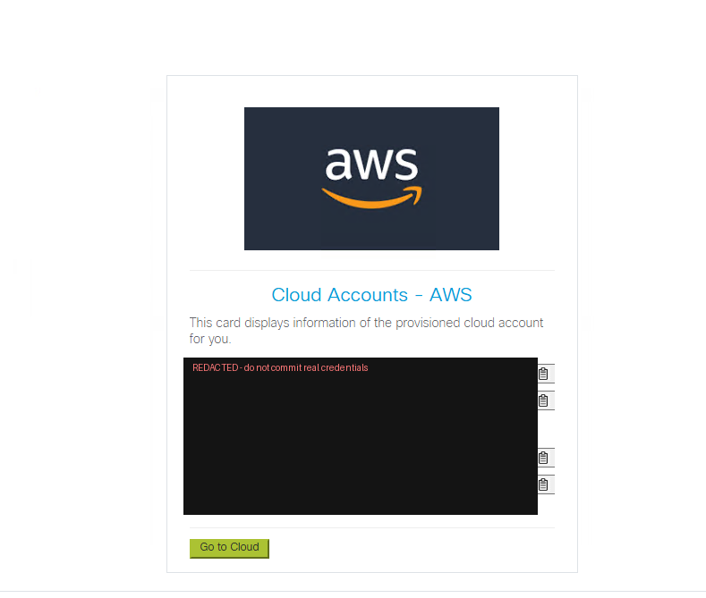
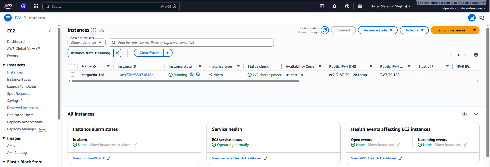

# AWS Provisioning on dCloud via iDAC

Automate the provisioning of AWS resources (VPC + EC2) from a Windows jumphost inside a dCloud session, using the **iDAC** (Infrastructure Data Center Automation) SDK and a trigger script.

This guide walks you through preparing the jumphost, installing the tooling, configuring the iDAC CLI, and running the automation that triggers the API call to iDAC.

---

## Table of Contents

- [Prerequisites](#prerequisites)
- [Step 1 — Enable Guest Automation on the jumphost](#step-1--enable-guest-automation-on-the-jumphost)
- [Step 2 — Install Python 3.12](#step-2--install-python-312)
- [Step 3 — Install the required Python libraries](#step-3--install-the-required-python-libraries)
- [Step 4 — Configure the iDAC CLI](#step-4--configure-the-idac-cli)
- [Step 5 — Add the trigger script](#step-5--add-the-trigger-script)
- [Step 6 — Run the automation](#step-6--run-the-automation)
- [Step 7 — Open the generated URL](#step-7--open-the-generated-url)
- [Step 8 — Go to the Cloud (auto-login to AWS)](#step-8--go-to-the-cloud-auto-login-to-aws)
- [Explore & Monitor](#explore--monitor)
- [Troubleshooting](#troubleshooting)

---

## Prerequisites

Before you start, make sure you have:

- An active **dCloud session** with a **Windows jumphost** you can access.
- Administrator rights on the jumphost (needed to install Python and write to `C:\`).
- The trigger script `session_trigger_aws.py` (provided with this repo).
- Network access from the jumphost to `idac.cat-dcloud.com`.

> **Note:** Complete the steps in order. Guest Automation (Step 1) must be enabled **before** you start the session so the automation hooks run correctly.

---

## Step 1 — Enable Guest Automation on the jumphost

Before starting your dCloud session, enable **Guest Automation** on the Windows jumphost. This is required for the automation to run.

In the dCloud VM editor, open **Edit Virtual Machine → Guest Automation** and:

1. Check **Enable Startup Automation**.
2. Set **Command to Execute** to:
   ```text
   C:\Python312\python.exe  C:\scripts\session_status.py
   ```
3. Set **Delay (sec)** to `40`.



> The `Session.xml` file will be deposited in the `dcloud` folder of the VM root drive, which the automation relies on.

---

## Step 2 — Install Python 3.12

Install **Python 3.12** on the Windows jumphost.

- Download it from the official release page: <https://www.python.org/downloads/release/python-3120/>
- Choose the **Windows installer (64-bit)** — the recommended build.



> **Important:** During installation, tick **“Add python.exe to PATH”**. Confirm the install completed before continuing:
> ```powershell
> python --version
> ```

---

## Step 3 — Install the required Python libraries

Once Python 3.12 is fully installed, open a terminal and install the required libraries:

```powershell
python -m pip install requests lxml bs4 idac-sdk
```

| Library      | Purpose                                  |
| ------------ | ---------------------------------------- |
| `requests`   | HTTP calls to the iDAC API               |
| `lxml`       | XML parsing                              |
| `bs4`        | HTML/XML scraping (BeautifulSoup)        |
| `idac-sdk`   | iDAC client SDK and CLI                  |

---

## Step 4 — Configure the iDAC CLI

Configure the iDAC package and CLI for your dCloud session.

For an interactive setup, run:

```powershell
idac config
```

Or configure it non-interactively in a single command:

```powershell
idac config --controller-url idac.cat-dcloud.com --controller-proto https --api-version 2.0 --auth-type DCLOUD_SESSION --vpn none
```

---

## Step 5 — Add the trigger script

Copy the trigger script into a `scripts` directory on the jumphost. If the directory does not exist, create it:

```powershell
mkdir C:\scripts
```

Then place the script there:

```text
C:\scripts\session_trigger_aws.py
```

This script contains everything needed to trigger the API call to iDAC.

---

## Step 6 — Run the automation

Run the script. A CLI window will pop up showing the automation process:

```powershell
python C:\scripts\session_trigger_aws.py
```

Wait for the automation to complete.

---

## Step 7 — Open the generated URL

When the automation finishes, a **URL shortcut** is added to the Chrome browser (for example, the **Login Url** shortcut on the bookmarks bar).



If the shortcut is **not** there:

1. Open the `dcloud` folder on the VM root drive (`C:\dcloud`).
2. Find the `url` text file.
3. Open it and copy the iDAC automation URL into any browser.



---

## Step 8 — Go to the Cloud (auto-login to AWS)

Opening the URL brings you to the final screen: a **Cloud Accounts – AWS** card showing the details of the cloud account provisioned for you (Account ID, User, Access Key, and Access Secret).

From there, click **Go to Cloud**. This takes you straight into AWS — **no credentials needed**, it performs an auto-login for you.



> 🔒 **Security note:** the credential values in this screenshot have been **redacted** on purpose. The real card shows a live **Access Key** and **Access Secret** — never commit an unredacted version to Git, share it, or paste it anywhere public.

Once you're in, you'll land in the AWS console with your provisioned resources — for example, the running EC2 instance from the VPC + EC2 recipe:



---

## Explore & Monitor

- **Explore the recipe** and its contents:
  <https://recipes.cat-dcloud.com/edit/eargueda-idac-re/cpoc/eargueda/vpc+ec2-test.cfg#/Details>

- **Check the status** of your recipe run:
  <https://board.cat-dcloud.com/>

---

## Troubleshooting

| Symptom | Likely cause | Fix |
| --- | --- | --- |
| Automation does not run at startup | Guest Automation not enabled | Re-check [Step 1](#step-1--enable-guest-automation-on-the-jumphost) before starting the session |
| `python` / `pip` not recognized | Python not on PATH | Reinstall with **Add to PATH**, or use `C:\Python312\python.exe` explicitly |
| `idac: command not found` | `idac-sdk` not installed | Re-run [Step 3](#step-3--install-the-required-python-libraries) |
| No URL shortcut in Chrome | Shortcut not created | Open `C:\dcloud\url` and paste the URL manually ([Step 7](#step-7--open-the-generated-url)) |
| Clicking **Go to Cloud** doesn't log in | Session/recipe not fully provisioned | Check the [board](https://board.cat-dcloud.com/) for status, then reopen the URL ([Step 8](#step-8--go-to-the-cloud-auto-login-to-aws)) |
